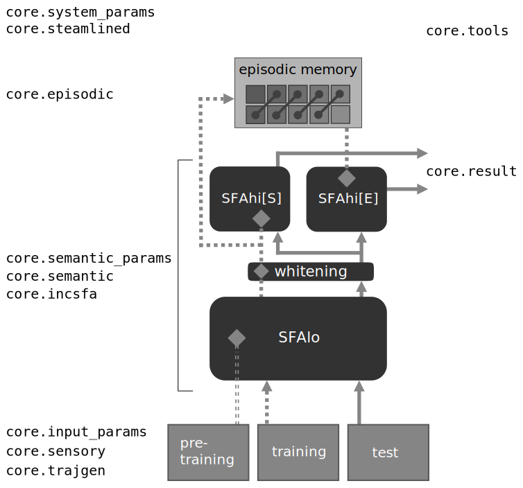

.. Episodic Memory and Sensory Representations documentation master file, created by
   sphinx-quickstart on Mon Feb 18 13:32:33 2019.
   You can adapt this file completely to your liking, but it should at least
   contain the root `toctree` directive.

Welcome to the documentation of Tuning Sensory Representations!
=============================================================================

.. note:: For historical reasons, some naming conventions differ between the publication
          and the code.

          ==============================   =============================
          publication                      code
          ==============================   =============================
          pre-training (data / input)      training (data / input)
          training (data / input)          forming (data / input)
          test (data / input)              testing (data / input)
          :math:`SFA_{lo}`                 SFA1
          :math:`SFA_{hi}`                 SFA2
          episode                          snippet
          ==============================   =============================

.. toctree::
   :maxdepth: 2
   :caption: Contents:
   :name: mastertoc

   getting_started

.. toctree::
   :maxdepth: 2
   :caption: Package core:
   :name: coretoc

   system_params_doc
   streamlined_doc
   input_params_doc
   sensory_doc
   trajgen_doc
   semantic_params_doc
   semantic_doc
   incsfa_doc
   episodic_doc
   result_doc
   tools_doc

.. toctree::
   :maxdepth: 2
   :caption: Generating results:
   :name: gentoc

   grid_doc
   gridconfig_doc
   learnrate_doc

.. toctree::
   :maxdepth: 2
   :caption: Analyzing / visualizing results:
   :name: anatoc

   gridresults_doc
   figures_doc

------------------
Indices and tables
------------------

* :ref:`genindex`
* :ref:`modindex`
* :ref:`search`
